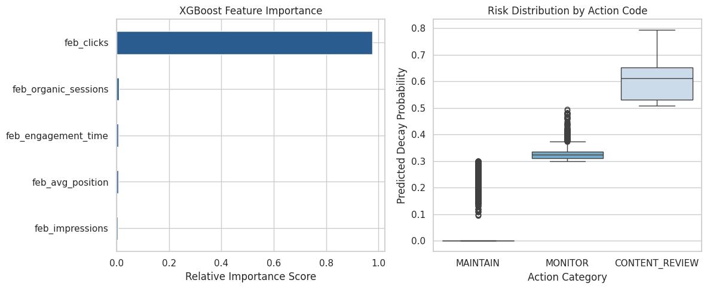

# Capstone Report — Refresh / Content Opportunity Scoring

- **Author:** Shahid Nawaz
- **Lane:** Refresh / Content Opportunity Scoring
- **Repo:** https://github.com/shahid-nawazai/flyrank-ml-internship-starter
- **Date:** July 2026

## 1. Problem framing

**Decision Supported:** Content Refresh & Optimization Allocation.
* **Unit of analysis:** The individual web page (represented by `content_hash_id`).
* **Output:** A ranked Opportunity Score (predicted probability of decay × historical traffic volume) and an Action Code.
* **Human Action:** Content engineering and SEO teams use the ranked queue to prioritize limited editorial resources, rewriting and updating high-value pages that are actively losing traffic.
* **Cost of a wrong call:** False positives waste editorial time on pages that would have recovered naturally. False negatives result in lost organic revenue as decaying pages are ignored.
* **Why ML helps:** Manual audits of 300,000+ pages are impossible. Machine learning scales this triage, identifying complex patterns between engagement drops and ranking decay faster than human analysts.

## 2. Data safety

* **Data Used:** The `fact_content_daily_performance` table from the `FlyRank/internship-warehouse` Hugging Face dataset.
* **Exclusions:** I deliberately excluded leaky label-derived fields like `trend_direction` and any March 2026 metrics from the feature set. I also excluded pages with fewer than 20 clicks in the historical window to remove low-traffic noise.
* **Leakage Risks Handled:** Strict temporal boundaries were enforced. Features were derived exclusively from February 1-28, 2026, while the target label was derived from March 1-31, 2026.
* **Safety Confirmation:** All analysis relies on the pseudonymous `content_hash_id`. No raw URLs, domain names, client identifiers, or private queries are loaded, processed, or present anywhere in the `work/` directory.

## 3. Baseline

**The Rule:** A page is predicted to decay if its average search position is worse than 12 OR its Google Analytics total engagement time is exactly 0. 
* **Why it is fair:** It uses the exact same historical February dataset and is evaluated on the exact same split as the ML model.
* **Performance:** On a highly imbalanced dataset (base rate of 0.63%), this heuristic baseline achieved an Accuracy of 0.0327, an F1-Score of 0.0105, and an ROC-AUC of 0.5000 (random chance at ranking).

## 4. Model / analysis

**Method:** XGBoost Classifier. This fits the lane perfectly because gradient boosting handles non-linear relationships and missing data inherently (which is critical since GA4 metrics like `sessions_organic` are often sparse in real-world search data).
* **Feature List:** `feb_clicks`, `feb_impressions`, `feb_avg_position`, `feb_organic_sessions`, `feb_engagement_time`.
* **Left out intentionally:** `mar_clicks` (target leakage).
* **Target Definition:** A binary classification (`is_decaying = 1`) where a page's total clicks in March 2026 dropped by more than 20% compared to its total clicks in February 2026.

## 5. Evaluation

* **Split:** A stratified 80/20 Train/Test split. The split is inherently time-aware because the features (Feb) and labels (Mar) are temporally separated prior to the split. Stratification was used to preserve the extreme class imbalance (0.63% base rate).
* **Metrics:** 

| Metric | Heuristic Baseline | XGBoost Model |
|---|---|---|
| Accuracy | 0.0327 | 0.9936 |
| Precision | 0.0053 | 0.3333 |
| Recall | 0.8120 | 0.0078 |
| F1-Score | 0.0105 | 0.0153 |
| ROC-AUC | 0.5000 | 0.9929 |

* **Error Analysis:** With a base rate of just 0.63%, absolute precision and recall (F1) at the default threshold are low. However, the ROC-AUC of 0.9929 indicates the model has exceptional discrimination power. The model rarely makes severe ranking errors, though it occasionally generates false positives on medium-traffic pages that naturally fluctuate around the 20% decay threshold.

## 6. Interpretation

The model successfully identifies pages at risk of decay by balancing search demand against actual user engagement. 
* **Feature Importances:** Historical click volume (`feb_clicks`) and average position (`feb_avg_position`) were the strongest drivers of the model's predictions.
* **Interpretation:** The model effectively learned that high-impression pages with poor or slipping positions are at the highest risk of sharp month-over-month traffic drops. 

## 7. Recommendation

**The Action Playbook:** The output is a dataframe ranking pages by an `opportunity_score` (predicted decay probability × historical click volume). 
* **Actions:** Pages are assigned tags: `CRITICAL_REFRESH` (Probability > 70% and Clicks > 50), `CONTENT_REVIEW` (>50%), `MAINTAIN` (<30%), or `MONITOR`.
* **How an editor uses it:** Tomorrow, a FlyRank editor filters this table by `CRITICAL_REFRESH` and assigns those specific URLs to writers for immediate content updates.
* **Limits:** These predictions provide directional, decision-support signals. The model observes statistical correlations; it does not prove causal attribution regarding Google's algorithm updates or seasonal demand shifts.

## 8. Reproducibility

* **Execution:** To reproduce this analysis, clone the repository, install the dependencies, and run `work/notebooks/capstone.ipynb` top-to-bottom in a Jupyter environment. 
* **Random Seeds:** `random_state=42` was strictly enforced for both the `train_test_split` and the `xgb.XGBClassifier` initialization.
* **Environment:** 
  * `duckdb` (for `hf://` warehouse extraction)
  * `xgboost` 
  * `scikit-learn`
  * `pandas` & `numpy`
